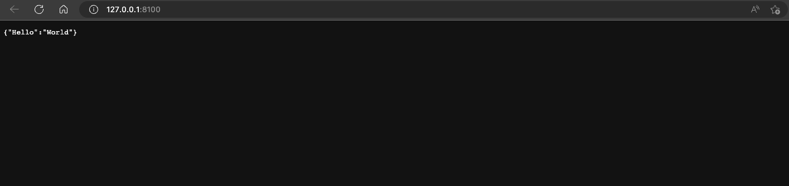
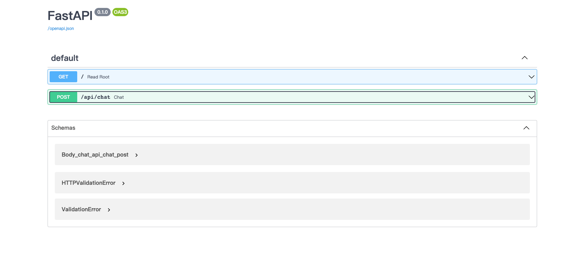
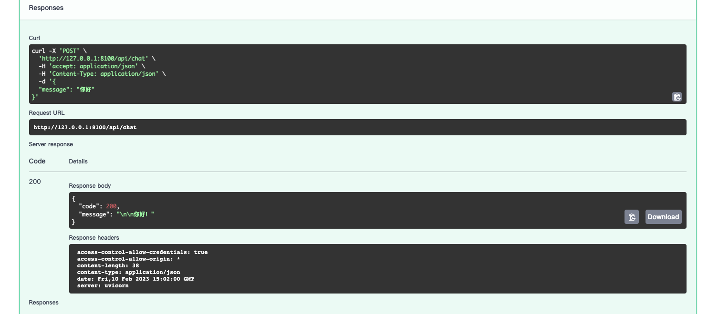

# ChatGPT-FastAPI

🎉基于[FastAPI (tiangolo.com)](https://fastapi.tiangolo.com/)开发的ChatGPT后端程序

感谢支持，请求Star🌟

## How to Use❓


### 1、Clone

`git clone https://github.com/ZeroMean/ChatGPT-FastAPI.git`

### 2、RUNNN

请先在main.py替换您的API_KEY⚠️

```shell
cd ChatGPT-FastAPI

pip install -r requirements.txt

python main.py
```

## 3、GOOO

> URL:http://127.0.0.1:8100
>
> 

## 4、Docs

> URL:http://127.0.0.1:8100/docs
>
> 
>
> 


